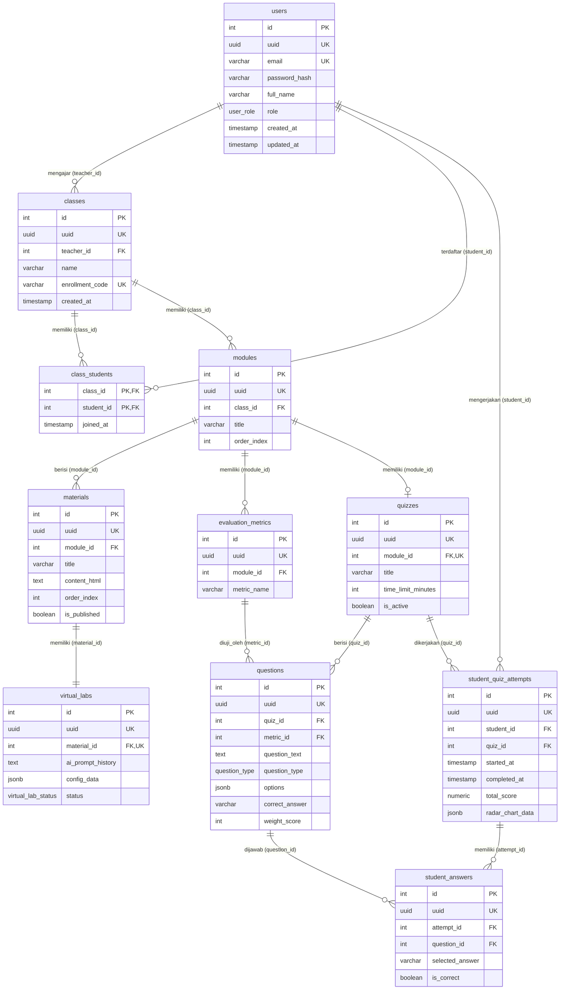

# Dokumentasi Skema Basis Data & Model ERD (Tahap 1)

Dokumen ini berisi rancangan struktur model basis data (*ERD Logical Model*) untuk Tahap Pertama pada aplikasi **ChemistFun**, yang diimplementasikan menggunakan **FastAPI**, **SQLAlchemy 2.0 (Declarative Mapping)**, dan **PostgreSQL**.

> **Strategi Identifikasi Entitas (Hybrid ID & UUID Slug)**:
> - **`id` (INTEGER, Primary Key, Auto-increment)**: Digunakan secara internal sebagai primary key dan referensi foreign key. Menjamin performa *join* dan *indexing* yang sangat cepat di level database PostgreSQL.
> - **`uuid` (UUID, Unique, Indexed)**: Berfungsi sebagai *public slug* / *external identifier* yang diekspos ke API dan Frontend (Vue.js) untuk mencegah serangan enumerasi ID (*ID enumeration attack*) dan menjaga kerahasiaan urutan data internal.

---

## 1. Diagram Hubungan Entitas (Entity Relationship Diagram)

---

## 2. Struktur Modul & Pemetaan File

Semua model database ditempatkan di dalam folder modul masing-masing di bawah `backend/app/modules/`:

| No | Kelompok Fungsionalitas | Lokasi File Model | Tabel yang Dikelola |
| :---: | :--- | :--- | :--- |
| **1** | **Manajemen Akses & Pengguna** | [`backend/app/modules/users/models.py`](file:///Users/handokodenih/DEV/chemistfun/backend/app/modules/users/models.py) | `users` |
| **2** | **Manajemen Kelas** | [`backend/app/modules/classes/models.py`](file:///Users/handokodenih/DEV/chemistfun/backend/app/modules/classes/models.py) | `classes`, `class_students` |
| **3** | **Manajemen Materi & Virtual Lab** | [`backend/app/modules/content/models.py`](file:///Users/handokodenih/DEV/chemistfun/backend/app/modules/content/models.py) | `modules`, `materials`, `virtual_labs` |
| **4** | **Bank Soal & Transaksi Siswa** | [`backend/app/modules/assessment/models.py`](file:///Users/handokodenih/DEV/chemistfun/backend/app/modules/assessment/models.py) | `evaluation_metrics`, `quizzes`, `questions`, `student_quiz_attempts`, `student_answers` |

---

## 3. Rincian Skema Tabel

### 3.1. Manajemen Akses & Kelas

#### Tabel `users`
Menyimpan data kredensial guru dan siswa.

| Kolom | Tipe Data | Constraint | Keterangan |
| :--- | :--- | :--- | :--- |
| `id` | `INTEGER` | Primary Key, Auto-increment | ID internal unik |
| `uuid` | `UUID` | Unique, Not Null, Index | Public slug identifier (default: `uuid4`) |
| `email` | `VARCHAR(255)` | Unique, Not Null, Index | Alamat email pengguna |
| `password_hash` | `VARCHAR(255)` | Not Null | Hash password keamanan |
| `full_name` | `VARCHAR(255)` | Not Null | Nama lengkap pengguna |
| `role` | `ENUM` | Not Null | Nilai: `'teacher'`, `'student'` |
| `created_at` | `TIMESTAMP` | Not Null | Server default `now()` (UTC) |
| `updated_at` | `TIMESTAMP` | Not Null | Server default `now()`, auto-update |

#### Tabel `classes`
Kelas atau mata pelajaran yang dibuat oleh guru.

| Kolom | Tipe Data | Constraint | Keterangan |
| :--- | :--- | :--- | :--- |
| `id` | `INTEGER` | Primary Key, Auto-increment | ID internal kelas |
| `uuid` | `UUID` | Unique, Not Null, Index | Public slug identifier (default: `uuid4`) |
| `teacher_id` | `INTEGER` | FK -> `users.id`, Not Null, Index | Guru pembuat/pengampu kelas |
| `name` | `VARCHAR(255)` | Not Null | Contoh: "Kimia Kelas XI" |
| `enrollment_code` | `VARCHAR(50)` | Unique, Not Null, Index | Kode acak unik siswa bergabung |
| `created_at` | `TIMESTAMP` | Not Null | Waktu kelas dibuat |

#### Tabel `class_students` *(Junction Table)*
Menghubungkan siswa dengan kelas (Relasi Many-to-Many).

| Kolom | Tipe Data | Constraint | Keterangan |
| :--- | :--- | :--- | :--- |
| `class_id` | `INTEGER` | Composite PK, FK -> `classes.id` (CASCADE) | ID Kelas |
| `student_id` | `INTEGER` | Composite PK, FK -> `users.id` (CASCADE) | ID Siswa |
| `joined_at` | `TIMESTAMP` | Not Null | Waktu siswa bergabung |

---

### 3.2. Manajemen Materi & Virtual Lab (Content Management)

#### Tabel `modules`
Bab atau topik besar di dalam kelas.

| Kolom | Tipe Data | Constraint | Keterangan |
| :--- | :--- | :--- | :--- |
| `id` | `INTEGER` | Primary Key, Auto-increment | ID internal modul |
| `uuid` | `UUID` | Unique, Not Null, Index | Public slug identifier (default: `uuid4`) |
| `class_id` | `INTEGER` | FK -> `classes.id` (CASCADE), Not Null, Index | ID Kelas pemilik modul |
| `title` | `VARCHAR(255)` | Not Null | Contoh: "Bab 1: Larutan Asam & Basa" |
| `order_index` | `INTEGER` | Not Null, Default `0` | Urutan penomoran bab |

#### Tabel `materials`
Materi teoritikal di dalam modul.

| Kolom | Tipe Data | Constraint | Keterangan |
| :--- | :--- | :--- | :--- |
| `id` | `INTEGER` | Primary Key, Auto-increment | ID internal materi |
| `uuid` | `UUID` | Unique, Not Null, Index | Public slug identifier (default: `uuid4`) |
| `module_id` | `INTEGER` | FK -> `modules.id` (CASCADE), Not Null, Index | ID Modul induk |
| `title` | `VARCHAR(255)` | Not Null | Judul materi pembelajaran |
| `content_html` | `TEXT` | Nullable | Konten materi rich text (HTML) |
| `order_index` | `INTEGER` | Not Null, Default `0` | Urutan materi dalam modul |
| `is_published` | `BOOLEAN` | Not Null, Default `False` | Status tayang materi |

#### Tabel `virtual_labs`
Menyimpan konfigurasi animasi simulasi interaktif (termasuk hasil generate AI). Relasi **1-to-1** dengan tabel `materials`.

| Kolom | Tipe Data | Constraint | Keterangan |
| :--- | :--- | :--- | :--- |
| `id` | `INTEGER` | Primary Key, Auto-increment | ID internal virtual lab |
| `uuid` | `UUID` | Unique, Not Null, Index | Public slug identifier (default: `uuid4`) |
| `material_id` | `INTEGER` | FK -> `materials.id` (CASCADE), Unique, Not Null | Relasi 1-to-1 materi |
| `ai_prompt_history` | `TEXT` | Nullable | Log instruksi guru/pengguna ke AI |
| `config_data` | `JSONB` | Not Null, Default `{}` | Parameter simulasi animasi (reaksi, konsentrasi, pH, dll) |
| `status` | `ENUM` | Not Null, Default `'draft'` | Nilai: `'draft'`, `'generating'`, `'ready'`, `'error'` |

---

### 3.3. Bank Soal & Metrik Evaluasi (Assessment)

#### Tabel `evaluation_metrics`
Indikator pemahaman untuk analisis **Grafik Radar (Radar Chart)**.

| Kolom | Tipe Data | Constraint | Keterangan |
| :--- | :--- | :--- | :--- |
| `id` | `INTEGER` | Primary Key, Auto-increment | ID internal metrik |
| `uuid` | `UUID` | Unique, Not Null, Index | Public slug identifier (default: `uuid4`) |
| `module_id` | `INTEGER` | FK -> `modules.id` (CASCADE), Not Null, Index | ID Modul induk |
| `metric_name` | `VARCHAR(255)` | Not Null | Contoh: "Perhitungan Titrasi", "Konsep Derajat Ionisasi" |

#### Tabel `quizzes`
Kuis penilaian evaluasi modul. Relasi **1-to-1** dengan tabel `modules`.

| Kolom | Tipe Data | Constraint | Keterangan |
| :--- | :--- | :--- | :--- |
| `id` | `INTEGER` | Primary Key, Auto-increment | ID internal kuis |
| `uuid` | `UUID` | Unique, Not Null, Index | Public slug identifier (default: `uuid4`) |
| `module_id` | `INTEGER` | FK -> `modules.id` (CASCADE), Unique, Not Null | Relasi 1-to-1 dengan modul |
| `title` | `VARCHAR(255)` | Not Null | Judul kuis |
| `time_limit_minutes` | `INTEGER` | Nullable | Batas waktu pengerjaan (menit) |
| `is_active` | `BOOLEAN` | Not Null, Default `True` | Status kuis aktif/tidak |

#### Tabel `questions`
Butir-butir soal di dalam kuis yang terkait dengan indikator metrik tertentu.

| Kolom | Tipe Data | Constraint | Keterangan |
| :--- | :--- | :--- | :--- |
| `id` | `INTEGER` | Primary Key, Auto-increment | ID internal soal |
| `uuid` | `UUID` | Unique, Not Null, Index | Public slug identifier (default: `uuid4`) |
| `quiz_id` | `INTEGER` | FK -> `quizzes.id` (CASCADE), Not Null, Index | ID Kuis induk |
| `metric_id` | `INTEGER` | FK -> `evaluation_metrics.id` (SET NULL), Nullable, Index | Indikator kompetensi soal |
| `question_text` | `TEXT` | Not Null | Teks pertanyaan soal |
| `question_type` | `ENUM` | Not Null | Nilai: `'multiple_choice'`, `'true_false'` |
| `options` | `JSONB` | Not Null | Opsi: `[{"id":"A", "text":"..."}, ...]` |
| `correct_answer` | `VARCHAR(50)` | Not Null | ID opsi kunci jawaban (misal "A") |
| `weight_score` | `INTEGER` | Not Null, Default `1` | Bobot nilai per butir soal |

---

### 3.4. Transaksi & Analitik Siswa (Student Records)

#### Tabel `student_quiz_attempts`
Mencatat saat siswa memulai dan menyelesaikan kuis beserta hasil analitik pemahamannya.

| Kolom | Tipe Data | Constraint | Keterangan |
| :--- | :--- | :--- | :--- |
| `id` | `INTEGER` | Primary Key, Auto-increment | ID internal sesi pengerjaan |
| `uuid` | `UUID` | Unique, Not Null, Index | Public slug identifier (default: `uuid4`) |
| `student_id` | `INTEGER` | FK -> `users.id` (CASCADE), Not Null, Index | Siswa yang mengerjakan |
| `quiz_id` | `INTEGER` | FK -> `quizzes.id` (CASCADE), Not Null, Index | Kuis yang dikerjakan |
| `started_at` | `TIMESTAMP` | Not Null, Server default `now()` | Waktu mulai pengerjaan |
| `completed_at` | `TIMESTAMP` | Nullable | Waktu submit / selesai |
| `total_score` | `NUMERIC(5, 2)` | Nullable | Nilai total akhir kuis |
| `radar_chart_data` | `JSONB` | Nullable | Hasil kalkulasi persentase pemahaman per `metric_id` |

#### Tabel `student_answers`
Mencatat setiap jawaban yang dipilih siswa (berguna untuk fitur auto-save dan analisis butir soal).

| Kolom | Tipe Data | Constraint | Keterangan |
| :--- | :--- | :--- | :--- |
| `id` | `INTEGER` | Primary Key, Auto-increment | ID internal rekaman jawaban |
| `uuid` | `UUID` | Unique, Not Null, Index | Public slug identifier (default: `uuid4`) |
| `attempt_id` | `INTEGER` | FK -> `student_quiz_attempts.id` (CASCADE), Not Null, Index | ID sesi attempt kuis |
| `question_id` | `INTEGER` | FK -> `questions.id` (CASCADE), Not Null, Index | ID Soal |
| `selected_answer` | `VARCHAR(50)` | Nullable | Jawaban yang dipilih siswa |
| `is_correct` | `BOOLEAN` | Nullable | Apakah jawaban benar |

---

## 4. Keunggulan Pola Arsitektur Ini

1. **Efisiensi Database (Integer PK & FK)**:
   - Penggunaan tipe integer auto-increment untuk kunci primer dan kunci asing membuat indeks B-Tree database berukuran jauh lebih kecil, hemat memori RAM, dan operasi *JOIN* antar tabel berkali-kali lipat lebih cepat dibanding menggunakan UUID sebagai FK.

2. **Keamanan URL & Public API (UUID Slug)**:
   - Seluruh endpoint API publik untuk Frontend menggunakan parameter `uuid` (contoh: `/api/modules/{uuid}` atau `/api/quizzes/{uuid}`), sehingga pengguna di Frontend tidak dapat menebak total data maupun merekayasa urutan ID (*anti-enumeration*).

3. **Fleksibilitas JSONB**:
   - `virtual_labs.config_data`: Format parameter simulasi animasi interaktif yang dihasilkan AI dapat berubah tanpa perlu migrasi skema database.
   - `student_quiz_attempts.radar_chart_data`: Data analitik disimpan siap saji untuk konsumsi langsung oleh grafik radar di Frontend.
